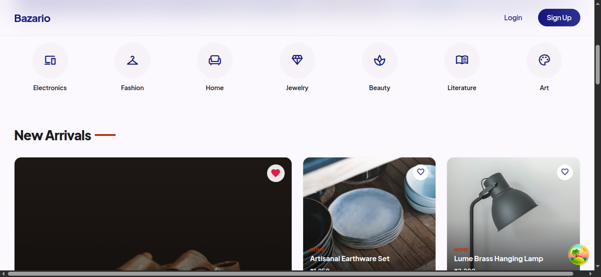
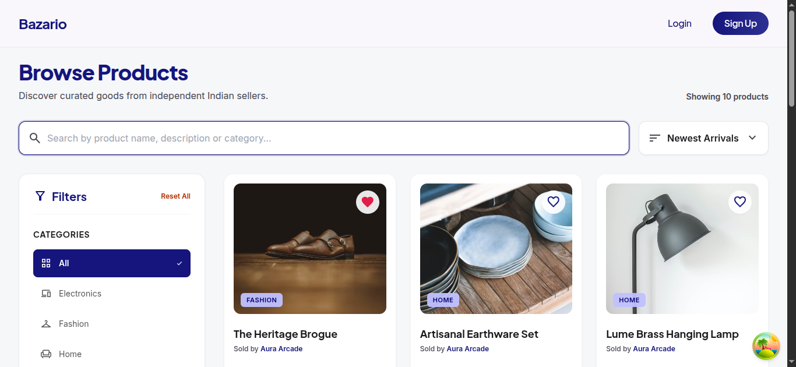
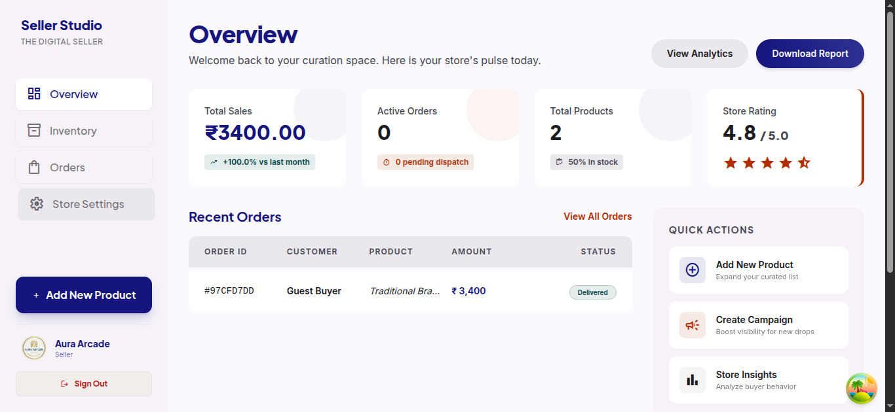
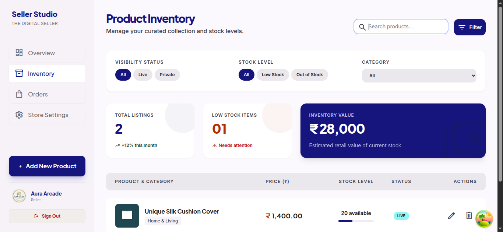

# Bazario

Bazario is a premium React-based e-commerce platform powered by Supabase. It features an elegant UI, real-time analytics, role-based workflows for buyers and sellers, and interactive product reviews.

## Screenshots

### Buyer Portal



### Seller Dashboard



## Features

* **Buyer Experience**: Live global search autocomplete, advanced catalog filtering, persistent shopping cart/wishlist (Zustand), and interactive review submissions with multi-image uploads.
* **Seller Tools**: Real-time sales metrics/charts, listing CRUD management with pagination, order state tracking (Pending/Shipped/Delivered), and storefront profile customizer.
* **Database & Storage**: PostgreSQL backing, row-level security (RLS), and review images hosted via Supabase Storage.

## Tech Stack

* **Frontend**: React 18, TailwindCSS (v3), Zustand, React Router DOM (v6), Vite
* **Backend**: Supabase (Database, Auth, Storage)

## Environment Variables

Create a `.env` file at the root:

```env
VITE_SUPABASE_URL=your_supabase_project_url
VITE_SUPABASE_ANON_KEY=your_supabase_anon_key
```

## Run Locally

```bash
npm install
npm run dev     # Dev server
npm run build   # Production build
```

## Project Roadmap
- [ ] Login with mobile number

## License

[MIT License](https://choosealicense.com/licenses/mit/)
